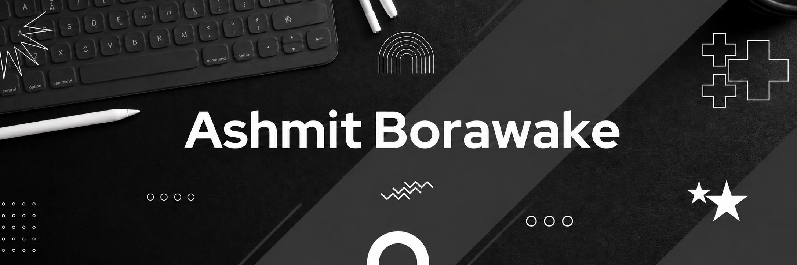

  

### 🚀 Full-Stack Developer | Software Engineering Student | Problem Solver

---

### 👨‍💻 About Me

I'm a **full-stack software engineering student** (CGPA: 9.46) at Pune Institute of Computer Technology, who enjoys building real products end-to-end from the screens users see to the systems running behind them. I've shipped production-ready platforms covering everything from municipal waste-compliance workflows to real-time civic reporting, and I have a solid foundation in Data Structures & Algorithms.

- 🏗️ Building scalable full-stack applications and solving real-world problems through technology
- 🧩 **600+** DSA problems solved on LeetCode
- 🏛️ Treasurer & Full-Stack Developer at **PICT IEEE Student Branch (PISB)**
- 📍 Pune, Maharashtra, India
---

### 🛠️ Technical Skills

<table>
<tr>
<td valign="top" width="33%">

#### 🔤 Languages

</td>
<td valign="top" width="33%">

#### 🎨 Frontend

</td>
<td valign="top" width="33%">

#### ⚙️ Backend

</td>
</tr>
<tr>
<td valign="top" width="33%">

#### 🗄️ Databases

</td>
<td valign="top" width="33%">

#### 🛠️ Developer Tools

</td>
<td valign="top" width="33%">

#### ☁️ Cloud & DevOps

</td>
</tr>
</table>

---

### 🚀 Experience

**Full Stack Developer Intern — Unitecture Design Solutions** `Mar 2026 – May 2026`

> Hybrid · DebriSense

- Architected a Next.js 14 monorepo with four role-based applications (Builder, Site Supervisor, PMC Officer, Admin) sharing a PostgreSQL database through Prisma for the complete C&D waste compliance lifecycle
- Designed and implemented 30+ REST APIs for WMP filing, trip management, approvals, QR verification, and role-based workflows secured with JWT authentication
- Built an automated Waste Management Plan (WMP) engine with PDF generation, approval workflows, compliance validation, and municipal sign-off
- Integrated Leaflet-powered geospatial dashboards and fleet tracking to monitor debris transportation and municipal operations in real time

**Web Development Intern — Pune Institute of Computer Technology** `Feb 2026 – Apr 2026`

> Pune, Maharashtra · CivicConnect

- Built a full-stack civic issue reporting platform with React, Express, PostgreSQL, and Socket.IO for real-time citizen–authority communication
- Implemented complete issue reporting workflows, including Guest Quick Report, GPS-based issue submission, image uploads, and frontend-backend integration
- Engineered a secure JWT-based authentication system with role-based access control, bcrypt password hashing, and Prisma ORM
- Designed OTP-based password recovery and automated email notification workflows using Nodemailer and Gmail SMTP

---

### 🧩 Projects

#### 🏙️ [CivicConnect](https://civic-connect.live/) — Multi-City Civic Issue Reporting Platform

_A full-stack platform for citizens to report infrastructure problems with GPS-tagged photos and real-time status tracking._

- Built a full-stack platform for citizens to report civic issues with location-tagged photos and track status through a clean, mobile-friendly UI
- Added real-time chat via Socket.IO rooms and REST APIs with JWT login, plus a Prisma/PostgreSQL database with role-based access for citizens, authorities, and admins
- Implemented automated complaint routing, issue escalation, and analytics dashboards for municipal management
- Deployed on AWS EC2 with Dockerized services and an Nginx reverse proxy for scalable, production-grade hosting

---

#### 💬 [Polychat](https://polychat-translation.vercel.app/auth) — Real-Time Multilingual Chat Application

_A real-time chat platform with AI-powered translation and secure, scalable messaging._

- Built a full-stack chat app with real-time messaging via WebSockets and JWT-protected pages
- Integrated the Gemini API for real-time message translation and used Zustand for clean, scalable state management across chat rooms
- Added automatic language detection, file sharing, and group chat for seamless multilingual conversations

---

#### 🎉 [Credenz'26](https://www.credenz.co.in/) — Official Event Management Platform

_The official platform for a technical festival with an immersive 3D experience, serving 800+ attendees._

- Built an event management platform with an immersive 3D landing page using React Three Fiber and Three.js, supporting 800+ event attendees through registration, cart checkout, and digital pass generation
- Developed secure REST APIs with Node.js, Express, Prisma, and PostgreSQL, implementing JWT authentication, OTP verification, and role-based access
- Delivered smooth Framer Motion animations across a Dockerized, enterprise-grade deployment

---

#### 🩸 Blood Bank Management System — Healthcare Management System

_A full-stack system to manage blood donation, hospital registration, and inventory tracking._

- Developed a full-stack system to manage blood donation, hospital registration, and inventory tracking for efficient request handling
- Implemented role-based access for hospitals, donors, and admins to ensure secure and restricted data access
- Designed RESTful APIs using Express.js and TypeScript for CRUD operations and real-time updates across modules
- Used MySQL for relational data storage and optimized queries for donation history, stock status, and hospital management

---

#### 🌐 [Portfolio Website](https://ashmit-borawake.vercel.app/) — Developer Portfolio Website

_A production-grade personal portfolio with a monochrome design and cinematic scroll-driven animation._

- Engineered a highly optimized, production-ready portfolio using React 19, Vite, and Tailwind CSS v4 with a component-driven architecture for a lightning-fast Time to Interactive
- Designed a dual-library motion system — Framer Motion for staggered viewport reveals and GSAP for continuous micro-interactions like a custom magnetic cursor — at a strict 60fps
- Integrated Lenis for smooth scrolling alongside advanced layout mechanics, including a sticky-scroll dual-timeline and an infinite momentum carousel
- Built a scalable CSS-variable theme engine supporting Light/Dark mode with a seamless `document.startViewTransition()` reveal effect

---

### 📊 GitHub Stats

---

### 🧠 Competitive Programming

**600+ problems** solved on LeetCode

---

### 🌟 Extracurricular & Leadership

**Treasurer & Full-Stack Developer** `Sep 2023 – Present`

> PICT IEEE Student Branch (PISB)

- Serving as Treasurer, managing budgeting and financial planning for flagship events including Credenz'26, Credenz Tech Days 2025, and TechRush 2025
- Contributed as a Full-Stack Developer for Credenz'26 and Frontend Developer for Clash and Reverse Coding, supporting event management and team coordination

---

**📬 ashmitborawake03@gmail.com · Pune, Maharashtra, India**

